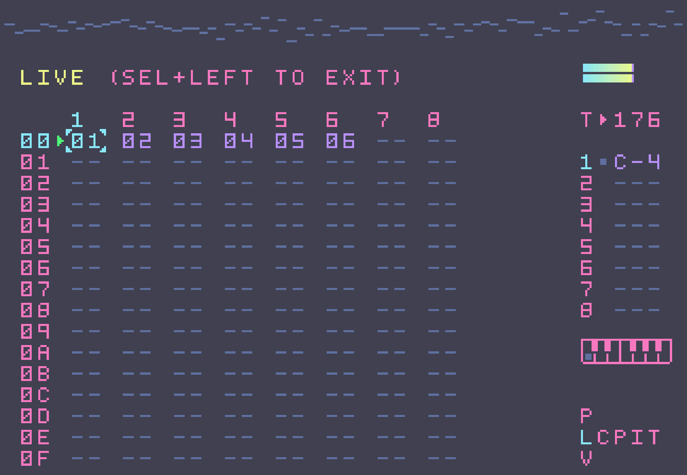

# Dracula for the [Dirtywave M8](https://dirtywave.com/products/m8-tracker-model-02)

> A dark theme for the [Dirtywave M8](https://dirtywave.com/products/m8-tracker-model-02).

## Install

All instructions can be found at [draculatheme.com/m8](https://draculatheme.com/m8).

## Team

This theme is maintained by the following person(s) and a bunch of [awesome contributors](https://github.com/dracula/m8/graphs/contributors).

|  |
| ------------------------------------------------------------------------------------------------------------ |
| [Michael Lawrence](https://github.com/michael-lawrence)                                                      |

## Community

- [Twitter](https://twitter.com/draculatheme) - Best for getting updates about themes and new stuff.
- [GitHub](https://github.com/dracula/dracula-theme/discussions) - Best for asking questions and discussing issues.
- [Discord](https://draculatheme.com/discord-invite) - Best for hanging out with the community.

## Dracula PRO

## License

[MIT License](./LICENSE)
